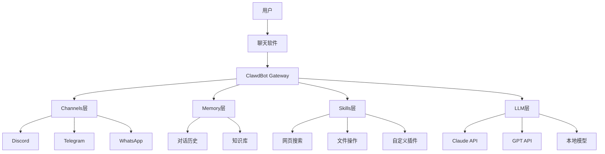

## 前言

想象一下,如果有一个AI助手,能够在你常用的任何聊天软件中随时待命,记得你说的每一句话,还能主动提醒你重要事项——这不是科幻电影,而是**ClawdBot**正在实现的未来。

2026年开年,ClawdBot作为一个开源个人AI助手项目引爆了技术圈,甚至让Mac mini一度卖断货。它让Claude、GPT等大模型AI真正融入我们的日常工作和生活,成为第一个"有记忆、会主动"的AI助手。

本文将带你从零开始,全面了解ClawdBot的核心功能,并手把手教你搭建属于自己的AI助手。

## 一、什么是ClawdBot?

### 核心定义

**ClawdBot**是由Peter Steinberger(PSPDFKit创始人)开发的开源个人AI助手框架。与传统AI聊天机器人不同,ClawdBot采用"**无处不在**"的设计理念——它直接运行在你熟悉的聊天软件中。

### 核心特点对比

| 特性 | ClawdBot | 传统AI聊天 |
| :--- | :--- | :--- |
| **使用方式** | 在常用聊天软件内使用 | 需要打开专门网页或APP |
| **对话记忆** | 跨平台持久记忆(MD文件) | 每次对话独立,云端存储 |
| **主动服务** | 支持定时提醒和主动通知 | 只能被动响应 |
| **数据存储** | 本地Markdown文件 | 存储在云端服务器 |
| **定制能力** | 完全可编程Skills系统 | 有限的自定义选项 |
| **隐私保护** | 完全自托管,数据本地化 | 数据上传至第三方 |

### 核心理念

ClawdBot不是一个AI模型,而是一个"**AI网关**"——它负责连接你的聊天软件和AI大模型API,让AI能力无缝融入日常沟通工具。


*图:ClawdBot三层架构设计*

## 二、ClawdBot的核心架构

理解ClawdBot的架构有助于后续配置和排错。它采用清晰的三层设计:

### 第一层:Gateway网关

Gateway是ClawdBot的核心控制平面,默认监听`localhost:18789`:

- **管理所有消息会话** - 统一调度多个平台的对话
- **路由不同渠道消息** - 智能分配到对应AI会话
- **处理工具调用** - 执行Skills和功能插件
- **维护记忆系统** - 持久化对话历史

### 第二层:Channels渠道

Channels负责连接各种聊天平台,支持8+主流平台:

| 渠道类型 | 支持平台 | 连接方式 |
| :--- | :--- | :--- |
| **即时通讯** | WhatsApp, Telegram, Signal | Bot API / Web协议 |
| **协作平台** | Discord, Slack, Teams | Bot API |
| **苹果生态** | iMessage, macOS | imsg CLI / 原生集成 |
| **开放协议** | Matrix, WebChat | 标准协议对接 |
| **区域应用** | Zalo, BlueBubbles | 社区插件 |

### 第三层:LLM大模型

ClawdBot支持多种AI模型后端:

| 模型提供商 | 认证方式 | 适用场景 |
| :--- | :--- | :--- |
| **Anthropic Claude** | API Key / OAuth | 推荐首选,ClawdBot原生优化 |
| **OpenAI GPT** | API Key / OAuth | 通用场景,功能全面 |
| **本地开源模型** | Ollama | 隐私优先,零API成本 |

## 三、四大核心优势

### 1. 全渠道无缝接入

ClawdBot的"全渠道"理念意味着:

- **同一个助手,多个入口**: 你在手机上用WhatsApp问的问题,在电脑上用Discord继续追问
- **上下文自动同步**: 无论从哪个渠道对话,助手都记得之前的交流内容
- **消息智能路由**: 可配置特定类型消息走特定渠道

### 2. 持久记忆系统

传统AI聊天每次对话都是"失忆"状态,而ClawdBot:

- 将记忆存储为**Markdown文件**,类似Obsidian笔记
- 支持**语义检索**,能关联你之前提过的信息
- 完全**本地存储**,数据不上传云端

记忆存储结构示例:

```bash
~/clawd/
├── memories/           # 对话记忆
│   ├── 2026-01-26.md  # 按日期组织
│   └── topics/        # 按主题分类
├── skills/            # 自定义技能
└── config.yaml        # 配置文件
```

### 3. 主动推送能力

这是ClawdBot区别于其他AI助手的**杀手级功能**:

| 主动推送场景 | 示例 |
| :--- | :--- |
| **晨间简报** | 每天早8点推送日程和天气 |
| **任务提醒** | 在你提过的截止日期前提醒 |
| **监控告警** | 监控的网站异常时主动通知 |
| **定时执行** | 定期运行脚本并汇报结果 |

### 4. Skills技能系统

Skills是ClawdBot的"外挂"系统,通过Markdown或TypeScript文件定义:

```markdown
# skill: web-search
使用 Brave Search API 搜索网络内容

## 触发条件
当用户询问需要实时信息的问题时

## 执行步骤
1. 调用 Brave Search API
2. 解析搜索结果
3. 生成摘要回复
```

社区已贡献100+现成Skills,涵盖:

- 网页浏览和截图
- 文件读写操作
- 日程管理集成
- 代码执行环境
- 智能家居控制

## 四、快速安装配置指南

### 环境要求

| 项目 | 要求 |
| :--- | :--- |
| **Node.js** | ≥ 22.x |
| **操作系统** | macOS / Linux / Windows (WSL2) |
| **内存** | ≥ 2GB可用 |
| **AI API** | Claude或OpenAI API Key |

### 第一步:全局安装

```bash
# 使用npm安装(推荐)
npm install -g clawdbot@latest

# 或使用pnpm
pnpm add -g clawdbot@latest
```

### 第二步:运行配置向导

```bash
# 启动交互式配置向导
clawdbot onboard --install-daemon
```

向导会引导你完成:

1. **AI模型配置** – 输入Claude或OpenAI API Key
2. **工作目录设置** – 默认`~/clawd`
3. **渠道启用** – 选择要连接的聊天平台
4. **守护进程安装** – 让Gateway后台持续运行

### 第三步:验证安装

```bash
# 检查服务状态
clawdbot status

# 深度健康检查
clawdbot health

# 诊断配置问题
clawdbot doctor
```

预期输出:

```bash
Gateway: ✓ Running on localhost:18789
Channels: ✓ Discord, Telegram connected
LLM: ✓ Claude API configured
Memory: ✓ 42 memories indexed
```

## 五、实战配置:连接Discord

Discord是ClawdBot最常用的渠道之一,配置步骤如下:

### 步骤1:创建Discord Bot

1. 访问Discord Developer Portal: `discord.com/developers/applications`
2. 点击"New Application"创建应用
3. 进入"Bot"页面,点击"Add Bot"
4. 记录**Bot Token**(点击Reset Token生成)

### 步骤2:配置Bot权限

在"OAuth2 → URL Generator"中勾选:

| 权限类别 | 具体权限 |
| :--- | :--- |
| **Scopes** | bot, applications.commands |
| **Bot Permissions** | Send Messages, Read Message History, Embed Links |

### 步骤3:邀请Bot到服务器

使用生成的OAuth2 URL邀请Bot到你的Discord服务器。

### 步骤4:配置ClawdBot

```bash
# 交互式配置Discord渠道
clawdbot configure --section channels.discord
```

输入Bot Token后,ClawdBot会自动完成连接。

### 步骤5:测试对话

在Discord服务器中@你的Bot或私信它:

```
@ClawdBot 你好,介绍一下你自己
```

Bot会使用Claude API生成回复并发送到Discord。

## 六、AI模型配置详解

### 方案一:官方Anthropic API

```yaml
# ~/clawd/config.yaml
llm:
  provider: anthropic
  model: claude-sonnet-4-20250514
  apiKey: sk-ant-xxxxx
```

**优点**:
- 直连官方,延迟最低
- 支持最新模型

**局限**:
- 需要海外信用卡支付
- 部分地区访问受限

### 方案二:第三方API代理(推荐国内用户)

```yaml
# ~/clawd/config.yaml
llm:
  provider: openai-compatible
  model: claude-sonnet-4-20250514
  apiKey: sk-xxxxx
  baseUrl: https://api.apiyi.com/v1  # 使用统一接口
```

**优点**:
- 支持支付宝/微信付款
- 价格比官方更优惠
- 访问稳定,无需翻墙

### 方案三:OAuth订阅认证

如果你已有Claude Pro/Max订阅:

```bash
clawdbot configure --section llm.oauth
```

优点是使用现有订阅额度,无需额外API费用。

## 七、实用Skills配置示例

### 1. 网页搜索Skill

```bash
# 配置Brave Search API
clawdbot configure --section web

# 输入你的Brave Search API Key
```

配置后ClawdBot可以搜索实时网络信息回答问题。

### 2. 文件操作Skill

ClawdBot内置文件读写能力:

```
我: 帮我读取 ~/Documents/notes.md 的内容
Bot: 正在读取文件... [文件内容]

我: 在文件末尾添加一行 "今日待办: 完成报告"
Bot: 已添加内容到文件
```

### 3. 浏览器Skill

```
我: 帮我访问 example.com 并截图
Bot: [启动浏览器] → [加载页面] → [生成截图] → [返回图片]
```

### 4. 自定义Skill

在`~/clawd/skills/`目录创建Markdown文件即可:

```markdown
# skill: daily-report
每日工作汇报生成器

## 描述
根据今日对话记录生成工作日报

## 触发词
生成日报, 今日总结

## 执行逻辑
1. 读取今日所有对话记忆
2. 提取工作相关内容
3. 生成结构化日报
```

## 八、成本估算与优化

| 费用项目 | 月费用 | 说明 |
| :--- | :--- | :--- |
| **VPS服务器** | ¥35-70 | 可选,本地运行免费 |
| **Claude API** | ¥70-140 | 取决于使用量 |
| **Claude Pro订阅** | ¥140 | 用OAuth认证可省API费 |
| **Claude Max订阅** | ¥1400 | 重度使用者,Opus无限制 |

### 成本优化建议

1. **本地运行**: 用家里的电脑或Mac mini运行,省去VPS费用
2. **API代理**: 通过国内API代理调用Claude API,价格更优惠
3. **模型选择**: 日常对话用claude-haiku,复杂任务再切换claude-sonnet
4. **记忆管理**: 定期清理无用记忆,减少Token消耗

## 九、与其他方案对比

| 对比维度 | ClawdBot | ChatGPT App | Claude App | 自建Bot |
| :--- | :--- | :--- | :--- | :--- |
| **多平台支持** | ⭐⭐⭐⭐⭐ 8+平台 | ⭐⭐ 仅App | ⭐⭐ 仅App | ⭐⭐⭐ 需逐个开发 |
| **对话记忆** | ⭐⭐⭐⭐⭐ 持久本地 | ⭐⭐⭐ 云端有限 | ⭐⭐⭐ 云端有限 | ⭐⭐ 需自行实现 |
| **主动推送** | ⭐⭐⭐⭐⭐ 完整支持 | ❌ 不支持 | ❌ 不支持 | ⭐⭐⭐ 需自行实现 |
| **隐私保护** | ⭐⭐⭐⭐⭐ 本地存储 | ⭐⭐ 云端存储 | ⭐⭐ 云端存储 | ⭐⭐⭐⭐ 取决于实现 |
| **定制能力** | ⭐⭐⭐⭐⭐ Skills系统 | ⭐⭐ GPTs有限 | ⭐⭐ Projects | ⭐⭐⭐⭐⭐ 完全自定义 |
| **上手难度** | ⭐⭐⭐ 需技术基础 | ⭐⭐⭐⭐⭐ 开箱即用 | ⭐⭐⭐⭐⭐ 开箱即用 | ⭐ 需大量开发 |

### 选择建议

- **ClawdBot适合**: 有一定技术背景、追求隐私和深度定制的用户
- **官方App适合**: 只需要简单AI对话的普通用户
- **自建Bot适合**: 需要完全自定义的企业级应用

## 十、常见问题FAQ

### Q1: ClawdBot需要VPS服务器吗?

不是必需的。ClawdBot可以在你的个人电脑上运行,只要电脑开机就能使用。但如果你希望24小时在线,建议使用:

- 家里的常开电脑(Mac mini等)
- 云服务器(VPS,每月¥35-70)
- 本地NAS设备

### Q2: 没有海外信用卡怎么获取Claude API?

可以通过国内API代理平台获取Claude API访问。这些平台支持支付宝、微信付款,提供与官方一致的API接口,且价格更优惠。注册后即可获取API Key,配置到ClawdBot即可使用。

### Q3: ClawdBot支持中文吗?

完全支持。ClawdBot本身只是一个网关,AI能力来自底层模型(Claude/GPT)。这些模型都对中文有很好的支持,你可以用中文与ClawdBot进行所有交互。

### Q4: 如何保证对话隐私?

ClawdBot采用"本地优先"设计:

- 对话记忆存储在你自己的设备上(Markdown文件)
- Gateway运行在localhost,不暴露公网
- 可通过SSH隧道或Tailscale安全访问
- 只有AI模型调用需要联网(API请求)

### Q5: 遇到问题去哪里求助?

ClawdBot有活跃的社区:

- **Discord服务器**: 加入后可直接与ClawdBot实例对话,还能提问
- **GitHub Issues**: `github.com/clawdbot/clawdbot`
- **官方文档**: `docs.clawd.bot`

Bug反馈通常能很快得到响应,有时作者会在聊天中实时修复。

### Q6: Windows用户如何安装?

Windows用户强烈建议使用WSL2:

1. 安装WSL2(推荐Ubuntu发行版)
2. 在WSL2中安装Node.js 22+
3. 按Linux步骤安装ClawdBot

原生Windows支持尚不完善,可能遇到各种问题。

## 十一、进阶玩法

### 1. 多Agent协作

ClawdBot支持创建多个会话(Session),它们可以相互通信:

```
Session A (研究助手): 调研市场数据
Session B (写作助手): 接收A的数据,生成报告
Session C (审核助手): 检查B的报告,提出修改建议
```

### 2. 自动化工作流

结合Cron定时任务:

- 每日早8点: 汇总邮箱重要邮件
- 每周一9点: 生成上周工作总结
- 每月1日: 统计本月API使用量

### 3. 智能家居集成

通过Home Assistant或MQTT连接智能设备:

```
我: 把客厅灯调暗一点
Bot: [调用Home Assistant API] 已将客厅灯亮度调至50%
```

### 4. 代码开发辅助

ClawdBot可以:

- 读取代码文件并解释
- 执行shell命令
- 浏览GitHub仓库
- 生成代码并保存到文件

## 十二、实际应用场景

### 场景1:个人事务助理

无需切换APP,在聊天窗口即可完成跨应用操作:

```
我: 帮我查询下周二的空闲时间,并向团队发送会议邀请邮件
Bot: [查询日历] → [起草邮件] → [发送邀请] 已完成,已发送给3位成员
```

### 场景2:知识库管理

基于本地Markdown笔记库回答问题:

```
我: 我上个月关于项目A的笔记里提到了什么关键点?
Bot: [检索本地笔记] 根据你的笔记,项目A的关键点包括:1. 性能优化...
```

### 场景3:网页任务自动化

内置无头浏览器(Headless Browser)能力:

```
我: 监控这个产品页面,降价超过20%时提醒我
Bot: [设置监控] 已设置监控,每2小时检查一次
```

## 十三、总结与展望

### 核心价值

ClawdBot代表了个人AI助手的新范式:

| 核心价值 | 说明 |
| :--- | :--- |
| **无处不在** | 在你常用的聊天软件中使用AI |
| **永不遗忘** | 持久化记忆,真正了解你 |
| **主动服务** | 不再被动等待,主动推送提醒 |
| **完全可控** | 开源自托管,数据永远属于你 |
| **无限扩展** | Skills系统让能力无上限 |

### AI Agent的未来

ClawdBot的出现标志着AI从"聊天机器人"向"智能体"的演进:

- **从被动到主动**: AI不再只是等待提问,而是主动思考和行动
- **从单一到全能**: AI不再局限于对话,而是能操作真实世界
- **从云端到本地**: AI不再依赖SaaS,而是可以私有化部署

### 下一步行动

如果你想让AI真正融入日常工作流:

1. 安装ClawdBot: `npm install -g clawdbot@latest`
2. 获取Claude API: 推荐通过国内API代理快速获取
3. 运行配置向导: `clawdbot onboard --install-daemon`
4. 连接你的第一个渠道(推荐从Discord开始)
5. 加入ClawdBot Discord社区交流经验

## 参考资料

1. **ClawdBot官网**: 产品介绍和快速开始
   - 链接: `clawd.bot`
2. **ClawdBot官方文档**: 完整配置指南
   - 链接: `docs.clawd.bot`
3. **GitHub仓库**: 开源代码和Issues
   - 链接: `github.com/clawdbot/clawdbot`
4. **MacStories深度评测**: 使用体验分享
   - 链接: `macstories.net/stories/clawdbot-showed-me-what-the-future-of-personal-ai-assistants-looks-like/`
5. **Peter Steinberger个人站**: 作者博客
   - 链接: `steipete.me`

## 附录:架构示意图



*图:ClawdBot完整架构图*

---

**文章标签**: `AI Agent` `ClawdBot` `AI助手` `自动化` `开源项目`

**撰写日期**: 2026年1月27日

**作者**: [你的名字]

**转载声明**: 本文为原创内容,转载请注明出处。
