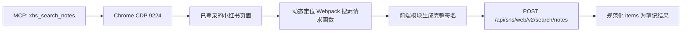

## 起因

最近在给一个多站点 MCP 工具补小红书笔记搜索。

最初的实现很直观：打开搜索页，等待页面渲染，再从 `window.__INITIAL_STATE__` 里读取 `search.feeds`。这种方案能用，而且比解析卡片 DOM 稳定一些，但它仍然依赖前端页面：

- 搜索页必须完整加载；
- 筛选条件要靠点击页面控件；
- 首屏、翻页和异常状态分散在不同前端状态里；
- 页面结构一改，选择器和状态读取逻辑就可能失效。

既然网页自己也要请求结构化数据，能不能保留真实 Chrome 的登录环境，但跳过搜索框、筛选面板和结果卡片，直接调用内部 API？

答案是可以。

本文记录的是 2026 年 7 月实际验证过的一条路径：**Chrome CDP + 小红书页面上下文 + 前端自身的请求函数**。

## 核心接口

当前网页搜索使用的笔记接口是：

```text
POST https://so.xiaohongshu.com/api/sns/web/v2/search/notes
```

一次普通搜索的请求体大致如下：

```json
{
  "keyword": "露营",
  "page": 1,
  "page_size": 20,
  "search_id": "search-mrksdol4",
  "sort": "general",
  "note_type": 0,
  "ext_flags": [],
  "geo": "",
  "image_formats": ["jpg", "webp", "avif"]
}
```

返回值已经是可直接消费的结构化对象：

```text
response
├── hasMore
├── requestDqaInstant
└── items[]
    ├── id
    ├── modelType
    ├── xsecToken
    └── noteCard
        ├── displayTitle
        ├── type
        ├── user
        ├── interactInfo
        ├── cover
        └── imageList
```

其中 `id` 和 `xsecToken` 很重要。后续打开笔记详情时，需要把它们一起带上：

```text
https://www.xiaohongshu.com/explore/<note_id>?xsec_token=<token>&xsec_source=pc_feed
```

看起来只要在页面里 `fetch()` 一下就结束了，但真正麻烦的是请求签名。

## 为什么不能直接 fetch

小红书网页请求会带一组动态请求头：

```text
X-s
X-t
X-S-Common
X-B3-TraceId
X-Xray-TraceId
X-Rap-Param
```

页面上确实暴露了 `window._webmsxyw`，调用它可以生成 `X-s` 和 `X-t`：

```js
const signed = window._webmsxyw(
  "/api/sns/web/v2/search/notes",
  payload
)
```

但这还不够。

我做了两次验证：

1. 只使用 `_webmsxyw` 返回的 `X-s` / `X-t`，接口能收到请求，但业务层拒绝；
2. 从上一条正常请求里复制 `X-S-Common` 再重放，新请求仍然失败。

这说明 `X-S-Common` 不是一个可以长期缓存的会话常量，它和当前请求环境、签名或时间有关。继续把签名算法搬到 Node.js，不但维护成本高，也很容易随着前端升级失效。

更稳妥的办法是：**不要自己生成完整签名，让小红书已经加载的前端请求模块替我们生成。**

## 技术方案：Chrome CDP 只负责提供执行环境

整体链路如下：



这里的 Chrome 不是用来点击页面，而是提供三样东西：

1. 独立且持久的登录态；
2. 完整的浏览器指纹和页面运行环境；
3. 小红书已经初始化好的请求、签名和拦截器模块。

搜索数据直接来自 API 响应，不读取结果卡片 DOM，也不需要模拟输入和点击。

## 使用隔离的 Chrome profile

不要把日常使用的主 Chrome profile 交给自动化程序。建议为小红书单独创建一个 profile，并且只监听本机地址：

```bash
/Applications/Google\ Chrome.app/Contents/MacOS/Google\ Chrome \
  --remote-debugging-address=127.0.0.1 \
  --remote-debugging-port=9224 \
  --user-data-dir="$HOME/.xhs-cdp-profile" \
  --profile-directory=Default \
  https://www.xiaohongshu.com
```

第一次启动后，在这个专用窗口里手动登录。之后登录态保存在 `~/.xhs-cdp-profile`，服务重启时可以继续复用。

不需要读取 Cookie，不需要把 Cookie 复制到配置文件，也不要把 CDP 端口暴露到公网。

## 动态找到小红书自己的搜索函数

网页使用 Webpack 打包。模块编号和导出名经过压缩，例如某次构建里可能是数字模块号和单字母导出，但这些值下次发布就可能改变，所以不能硬编码。

可用的稳定线索有两个：

- API 常量名：`WEB_AI_SEARCH_NOTES_V2`；
- 接口路径：`/api/sns/web/v2/search/notes`。

下面这段代码在页面上下文中完成动态定位和调用：

```js
async function searchXhsNotes(page, payload) {
  return await page.evaluate(async (requestBody) => {
    let webpackRequire

    window.webpackChunkxhs_pc_web.push([
      [`xhs-api-${Date.now()}`],
      {},
      (nextRequire) => {
        webpackRequire = nextRequire
      }
    ])

    if (!webpackRequire?.m) {
      throw new Error("XHS Webpack runtime is unavailable")
    }

    // 先找定义接口常量的配置模块。
    const configEntry = Object.entries(webpackRequire.m).find(([, factory]) => {
      const source = Function.prototype.toString.call(factory)
      return (
        source.includes("WEB_AI_SEARCH_NOTES_V2") &&
        source.includes("/api/sns/web/v2/search/notes")
      )
    })

    if (!configEntry) {
      throw new Error("XHS search API config module was not found")
    }

    const [configId] = configEntry

    // 再找引用该配置模块和接口常量的请求包装模块。
    const wrapperEntry = Object.entries(webpackRequire.m).find(
      ([moduleId, factory]) => {
        if (moduleId === configId) return false
        const source = Function.prototype.toString.call(factory)
        return (
          source.includes(configId) &&
          source.includes("WEB_AI_SEARCH_NOTES_V2")
        )
      }
    )

    if (!wrapperEntry) {
      throw new Error("XHS search API wrapper module was not found")
    }

    const exports = webpackRequire(wrapperEntry[0])
    const searchNotes = Object.values(exports).find(
      (value) =>
        typeof value === "function" &&
        Function.prototype.toString
          .call(value)
          .includes("WEB_AI_SEARCH_NOTES_V2")
    )

    if (!searchNotes) {
      throw new Error("XHS search API function was not found")
    }

    // 由小红书自己的请求模块处理 X-s、X-t、X-S-Common 等头。
    return await searchNotes(requestBody)
  }, payload)
}
```

调用方式：

```js
const response = await searchXhsNotes(page, {
  keyword: "露营",
  page: 1,
  page_size: 20,
  search_id: `search-${Date.now().toString(36)}`,
  sort: "general",
  note_type: 0,
  ext_flags: [],
  geo: "",
  image_formats: ["jpg", "webp", "avif"]
})
```

这段实现依赖小红书当前网页模块的语义线索，而不是某一个固定模块号。前端重新构建后，只要接口常量和请求包装关系没有同时改变，仍然能找到正确函数。

## 规范化搜索结果

API 返回的是网页前端模型，字段采用 camelCase。为了让 MCP 输出稳定，最好在浏览器之外做一次白名单映射：

```js
function normalizeSearchItems(items, webBaseUrl) {
  return items
    .filter((item) => item?.id && item?.xsecToken && item?.noteCard)
    .map((item) => {
      const card = item.noteCard

      return {
        result_id: item.id,
        note_id: item.id,
        xsec_token: item.xsecToken,
        detail_url:
          `${webBaseUrl}/explore/${encodeURIComponent(item.id)}` +
          `?xsec_token=${encodeURIComponent(item.xsecToken)}` +
          `&xsec_source=pc_feed`,
        type: card.type,
        title: card.displayTitle,
        user: {
          user_id: card.user?.userId,
          nickname: card.user?.nickname ?? card.user?.nickName,
          avatar: card.user?.avatar
        },
        interact_info: {
          liked: card.interactInfo?.liked,
          liked_count: card.interactInfo?.likedCount,
          collected: card.interactInfo?.collected,
          collected_count: card.interactInfo?.collectedCount,
          comment_count: card.interactInfo?.commentCount,
          shared_count: card.interactInfo?.sharedCount
        },
        cover: {
          width: card.cover?.width,
          height: card.cover?.height,
          url_default: card.cover?.urlDefault,
          url_pre: card.cover?.urlPre
        }
      }
    })
}
```

不要把整个响应对象原样返回。白名单映射可以减少接口字段变化带来的影响，也避免无意间暴露调试字段或会话相关信息。

## 分页与筛选

分页时应在同一次搜索中复用 `search_id`，只增加 `page`：

```js
const searchId = `search-${Date.now().toString(36)}`
const allItems = []

for (let pageNumber = 1; pageNumber <= 3; pageNumber += 1) {
  const response = await searchXhsNotes(page, {
    keyword: "露营",
    page: pageNumber,
    page_size: 20,
    search_id: searchId,
    sort: "general",
    note_type: 0,
    ext_flags: [],
    geo: "",
    image_formats: ["jpg", "webp", "avif"]
  })

  allItems.push(...(response.items ?? []))
  if (!response.hasMore) break

  // 低频、有界，不做并发轰炸。
  await new Promise((resolve) => setTimeout(resolve, 1500))
}
```

`page_size` 不等于最终笔记数量。实测响应里可能混有不同 `modelType` 的项目，所以最终数量应以规范化后的有效笔记为准，而不是简单相信数组长度。

筛选条件也应该继续使用网页实际使用的参数和值，不要凭空猜测枚举。当前默认请求里可以确认的字段包括 `sort`、`note_type`、`ext_flags` 和 `geo`。

## 实际验证

在已登录的专用 Chrome profile 中，我做了一次不操作 DOM 的真实调用：

```text
登录状态：有效
请求方法：POST
请求地址：https://so.xiaohongshu.com/api/sns/web/v2/search/notes
关键词：露营
返回 items：26
```

CDP 捕获到的请求头名称包括：

```text
x-b3-traceid
x-rap-param
x-s
x-s-common
x-t
x-xray-traceid
```

这些头全部由小红书自身的前端请求模块生成，程序没有读取或输出任何签名值。

## 几个容易踩的坑

### 1. 登录检测不能只看页面能不能搜索

未登录时搜索页也可能渲染输入框和部分内容。如果只检查“页面里有没有搜索容器”，很容易把游客状态误判为已登录。

更可靠的做法是组合判断：

- 是否存在用户头像或个人主页节点；
- 是否出现登录容器或二维码；
- 页面文字是否出现“请登录”“登录后查看”等提示。

我在未登录状态下调用接口时收到过 `-104` 权限错误；完成专用 profile 登录后，同一条页面内请求立即返回正常 `items`。

### 2. 不要硬编码 Webpack 模块号

模块号和导出名都是构建产物，随时可能改变。应通过接口常量、路径和引用关系动态定位，并在找不到时返回清晰错误。

### 3. 页面导航后要重新发现函数

页面刷新或跳转可能替换 Webpack runtime。不要跨页面长期保存函数句柄；每个新页面会话重新定位，或设置短生命周期缓存。

### 4. 只返回可序列化快照

不要把 Axios 实例、Vue ref、函数或循环引用带出页面。搜索函数完成后，应立即转换成普通对象，再交给 Node.js/MCP 层。

### 5. API 不是官方公开契约

接口路径、参数和前端模块都可能变化。生产实现需要超时、结果上限、错误映射和可观察日志，并保留受控 fallback。

## 数据安全和使用边界

这套方案的目标是复用本人正常登录的浏览器会话，做低频、只读的数据整理。建议至少遵守以下边界：

- 使用独立 Chrome profile，不连接日常主浏览器；
- CDP 只监听 `127.0.0.1`；
- 不导出 Cookie、签名值或浏览器存储；
- 不绕过验证码、登录限制或账号风控；
- 不做高并发、无限翻页或批量账号抓取；
- 尊重平台规则、内容版权和个人隐私。

如果接口返回登录、验证或账号异常，应停止自动化并由用户在专用 Chrome 窗口里处理，而不是继续尝试绕过。

## 总结

这次最有价值的结论不是“找到了一个接口”，而是确定了一种维护成本更低的调用方式：

> Chrome CDP 保留真实登录环境，小红书前端模块负责完整签名，业务代码只负责构造参数和规范化响应。

这样既绕过了脆弱的搜索 DOM，也不需要把签名算法搬出浏览器。对于带动态签名的网页内部 API，这通常比自己复刻请求头更稳定。

本文写作结构参考了：[《我做了一个 BOSS直聘抓取工具，开源了》](https://blog.xiaohuangyu.space/p/boss-zhipin-scraper-open-source/)。

相关资料：

- [Chrome DevTools Protocol](https://chromedevtools.github.io/devtools-protocol/)
- [Playwright `connectOverCDP`](https://playwright.dev/docs/api/class-browsertype#browser-type-connect-over-cdp)
